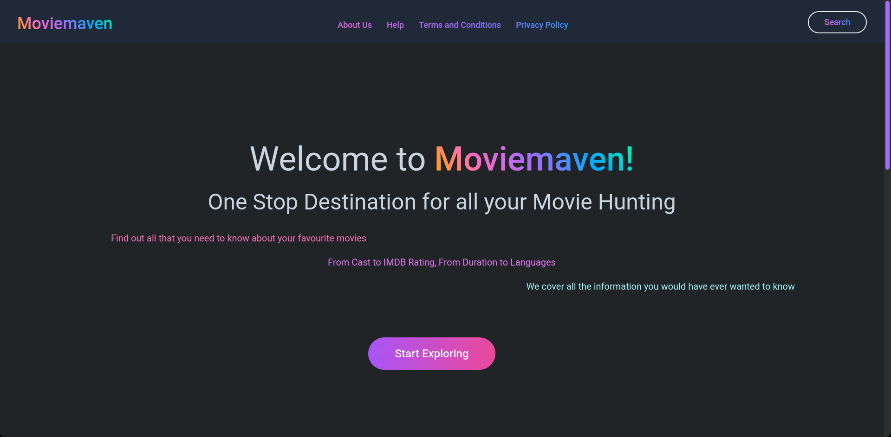

<!-- PROJECT LOGO -->
<br />
<div align="center">


<h3 align="center">MovieMaven</h3>

  <p align="center">
  The MovieMaven web app provides users with a user-friendly platform to search for movies easily, view their reviews and ratings, and a short summary of the movie.
- The project has provided us with an opportunity to learn and apply the fundamentals of web development, including HTML, CSS, ReactJS and TailwindCSS.
  </p>
</div>

## Built With

* 
* 


<!-- GETTING STARTED -->
## Getting Started

This is an example of how you may give instructions on setting up your project locally.
To get a local copy up and running follow these simple example steps.


### Installation


1. Clone the repo
   ```sh
   git clone https://github.com/ahmedfahim21/C02-Envision-Project/
   ```
2. Install and start frontend
   ```sh
   cd moviemaven
   npm install
   npm start
   ```